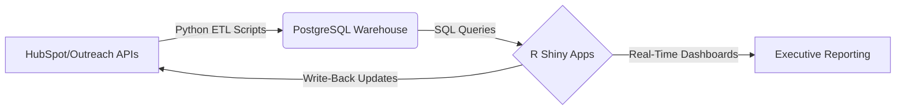
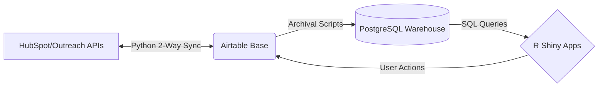

# Hi, I'm Aaron 👋
### Revenue Operations Leader & Full-Stack Developer

I specialize in bridging the gap between **Sales Strategy** and **Engineering**. I build the internal tools, API integrations, and data pipelines that power high-growth revenue teams.

---

### 🔒 Why are my contributions private?
Most of my recent work involves proprietary **commercial source code** for *The Sales Factory* and *Pitchpilot*, which resides in private organization repositories. 

While I can't share the code, I can share **what I build:**

## 🛠️ Technical Architecture & Projects

### 1. Enterprise Revenue Infrastructure - The Sales Factory
*Role: Head of Data & Technology Operations*

I architected a centralized data engine to replace manual reporting. This system synchronizes data between our CRM stack, Airtable, and our internal warehouse to provide real-time visibility for 80+ reps.

**The Stack:** `Python` • `Airtable` • `PostgreSQL` • `R Shiny` • `HubSpot API`

**API Integrations:** Built custom connectors to fetch call logs and deal stages from HubSpot & Outreach, bypassing native limitations.  
**Persistent State:** Developed R Shiny apps with write-back capabilities, allowing managers to edit database records directly from the dashboard.  
**Automation:** Automated reporting workflows to save 10+ managers over 5 hours per week each.  

### 2. SaaS Product Development - [Pitchpilot](https://www.pitchpilot.com/)
*Role: Co-Founder & Head of Engineering*

Co-developed an AI-driven GTM messaging platform from zero-to-one.
* **Full Stack:** Built the backend with **Flask (Python)** and frontend with **Vue.js**.
* **DevOps:** Managed CI/CD via **GitKraken** and GitHub PR workflows.
* **Database:** Designed the normalized schema in **PostgreSQL** to handle user authentication and data storage.

### 3. Open Source Research Tools
* **[easypower](https://cran.r-project.org/package=easypower):** I developed and published this R package on CRAN to make statistical power analysis more accessible for behavioral researchers.

---

## 💻 Tech Stack

---

### 📫 Connect
* **LinkedIn:** [Connect with me!](https://www.linkedin.com/in/aaron-mcgarvey93/)
* **RPubs:** [R Examples](https://rpubs.com/McGarveyA)
